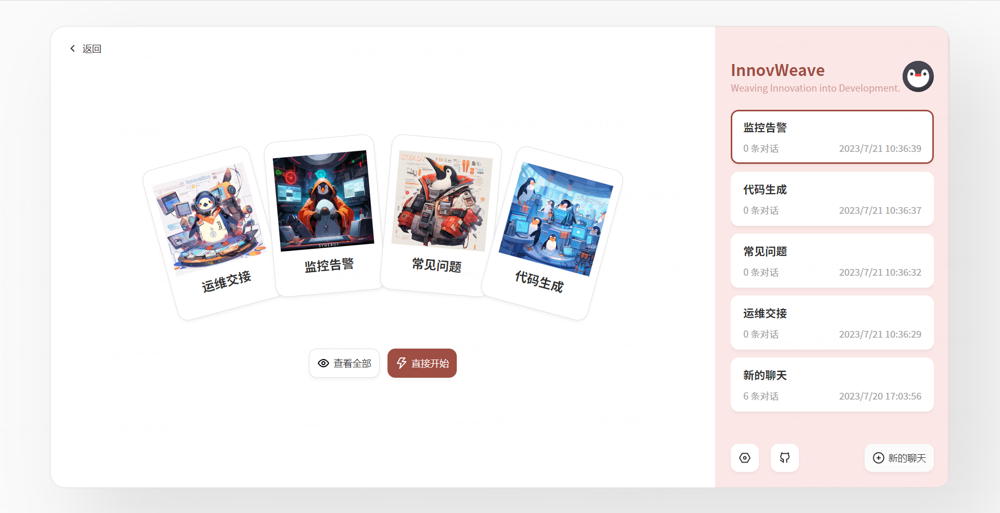
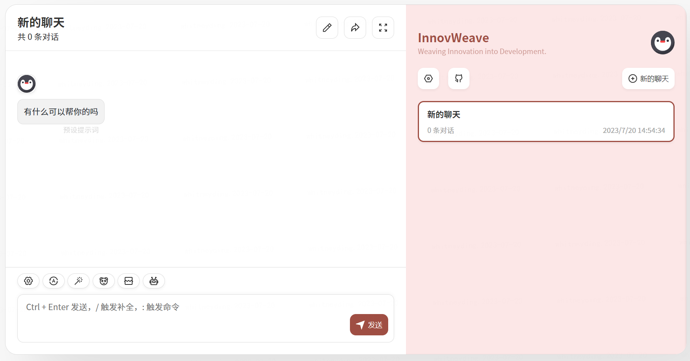

# InnovWeave

助力效率提升：基于ChatGPT的网页对话助手

## 团队成员

队长：周围

成员：邓晓栩、丁紫薇、王海涛、周宽、胡政、魏波、严高飞、赖伟健、张思源、何欣

## 展示

## Idea Spark

- 在研发效率的五个不同的流程场景，通过prompt engineer定制化的训练出最符合场景的提示词，以优化模型返回结果的准确性。 
- 为了体现微众的企业文化，使用AIGC技术生成webank概念图，这同时也贴合了本次比赛的主题。

- 在团队协作这一块我们可以说利用GitHub进行项目的托管、开发以及协作。形成完善的[git flow工作流](https://www.ruanyifeng.com/blog/2015/12/git-workflow.html)。
- 在应用的部署运维阶段，利用了vercel平台进行应用的CI/CD自动化流水线部署。

## 主题

基于AIGC的一站式研发效率助手——InnovWeave

## 产品背景

InnovWeave：将"Innov"（创新）和"Weave"（编织）结合在一起，强调AIGC在开发过程中促进创新的能力。

"Weaving Innovation into Development"
标语旨在突出"InnovWeave"作为一个推动创新的AIGC，并在开发过程中发挥重要作用。

传统的需求、交接文档和代码生成通常需要运维人员手动整理和编写，这个过程耗时耗力且容易出现遗漏和错误。为了产出流程提高效率，开发团队开发了InnovWeave助手，利用AIGC的先进技术，为开发人员提供智能辅助，从而降低文档和代码撰写的负担，保障文档和代码质量，给开发人员提供部分问题的解决方案。实现更加无缝和高效的交接体验。
产品介绍（业务可行性）

InnovWeave是一款基于AIGC的智能运维交接文档生成助手。作为一个辅助工具，InnovWeave的主要功能是为运维团队提供便捷的文档撰写和代码输出能力，帮助他们快速生成详细且准确的文档和代码。InnovWeave结合了人工智能技术和开发人员的输入，使得文档生成和代码输出变得更加高效和智能化。

主要功能：(功能完整性)

- 运维交接
由开发人员输入系统关键信息, 辅助开发人员生成一份可用的运维交接文档用于运维人员使用
- 需求编写
根据用户输入需求，辅助项目经理自动生成一份详细可用的需求文档
- 代码生成
根据前一步生成的需求文档，自动生成可用的代码框架，辅助开发人员编码，从而提高研发效率。
- 测试支持
由具体需求生成一份详细的测试用例，辅助测试人员完成案例编写工作

智能文档生成：通过与大语言模型集成，InnovWeave可以根据开发人员输入的关键信息和项目要求，自动化生成运维交接文档。用户只需简要描述项目和所需内容，助手将以智能化方式生成符合格式和规范的文档，涵盖配置、运维手册、常见问题解答等方面。

自定义模板：InnovWeave支持用户灵活定义文档模板，允许开发人员根据实际需求进行个性化配置。这样，生成的文档将与团队的标准和要求完美匹配，确保交接信息的一致性。

多语言支持：InnovWeave助手提供多语言支持，便于国际化项目的运维交接，帮助全球团队更好地合作。
智能推荐：助手不仅能够生成文档，还可以根据开发人员的输入和历史数据，智能推荐最佳的交接流程和策略，提供项目交接的优化建议。

运维交接文档：(功能展开点）

产品亮点---这里补充一下业务合规/先进性？（技术先进性）【已整合到PPT中】

- 高效智能：InnovWeave集成了AIGC的强大自然语言处理能力，能够快速生成开发流程中部分环节的交接文档，提高研发人员工作效率。
- 灵活定制：支持自定义文档模板和自定义提示词，使场景定制更加合理，提高交接文档的实用性和可扩展性。
- 知识沉淀：在生成交接文档的过程中产生的知识积累可以使得提示词越发准确，生成的交接文档有助于将知识沉淀下来，方便团队成员之间的知识传递和共享。
- 提升协作：InnovWeave助手能够减少团队成员的沟通成本，提高团队协作效率。
- 业务合规：InnovWeave将严格脱敏输入输出数据，保证银行关键数据不外泄。

技术亮点（有没有人补充一下）【已整合到PPT中】
- CI/CD
  - 项目托管/自动化流水线部署
- 前端工程化
  - 快速加载，SSG+SSR，编译产物优化 
- 全栈框架，简化API请求代码编写 
- 规范性检查，代码风格+Commit记录
- 大语言模型--智能生成/基于特定场景的Prompt

团队协作（团队协作性）
- 自动化部署：利用vercel平台实现代码的自动化流水线部署
- GitHub workflow：使用GitHub平台进行项目托管，采用Github workflow协同开发
- 分工协作：多人开发，分工明确，提高项目的开发效率

未来展望
- 针对其他需求场景提供定制化服务
- 进一步缩减开发人员的工作负担，利用AIGC技术智能识别开发人员提交的设计、开发文档，提取关键信息自动生成运维交接文档
- 在公司内部投喂公司的语料数据，训练离线的私有模型，这将比Prompt调试提供更高的准确性与可用性

7.20会议纪要
1、产品已有初步框架，进展良好。但仍需要考虑突出项目的亮点，明确AIGC在项目中带来的作用。如使用文档导入提取的技术，来减少用户的输入。
2、基于现有的Prompt产生的输出，在讲述的时候需要突出输出的哪一部分是基于AIGC技术生成的，是根据哪些关键词生成的，这些生成的部分如何评判它们的可用性。
3、讲ppt的时候，要突出做的产品的价值；用一条完整的事例串起各个场景，聚焦某个要点。

7.19会议纪要
1、针对现有的研发场景，提出创新点，能够切实的抓住公司现有的研发痛点，提高研发效率。目前初步将创新点定位运维交接场景，通过ChatGPT提供监控报警以及常见风险的SOP。
2、现有的其他场景仍保留，主要为运维场景提供服务，如：公司现有子系统在进行运维交接时，监控报警部分的功能有所缺失，可以通过需求设计、代码生成等场景功能来实现功能的补全。
3、常见风险SOP的生成需要考虑到不同的子系统可能需要有不同的SOP解决方案，因此需要指引用户在生成的时候输入相关的系统背景信息，对不同的业务系统进行分类。

7.21会议纪要
系统架构合理清晰，高度表扬
如何体现AIGC使用价值，创新点？
产品本身能力，生成运维交接文档的实用性，是否可用？(存在随机性)
产品解决了什么问题？PPT讲解时要讲
目前为交互式文档输入，对于未来展望，未来输入现有文档来提取信息代替手工输入，目前准确性不高
大语言模型的推理能力，在PPT中体现出来
辅助手段+工程化，总体来谈，这个产品真的有提升效率
依据行内所有系统的运维交接文档作为知识库，形成模板化，打标签，分类，对于要生成的交接文档提出一些安全建议和策略
给定固定的模板，不同项目往里填充不同的内容
用于辅助补充测试用例
从需求出发讨论，开发流程的各个阶段都可以向gpt提起需求，开始这个流程。感觉像是强行想出了一个闭环。扩写需求的考虑方向不太正确
提醒哪些需求没有做到，由专业运维人员提出具体需求
未来需要一个系统，运维进入系统后，采集监控。运维去读
交接文档的标准化，这个事情还没人做，目前口述
不建议讲需求，可以就不串故事，聊代码、聊测试相关
灵感编织器

工程化
实用性
价值
效率提升前后对比，聚焦到具体的点上

限定输出
考虑亮点在哪里
推理能力（例如人工没有考虑到，但是AIGC想到了）
归纳总结的能力

可行性，实用性，业务落地，辅助工具，工程化，做全行的aigc，标准模板的迭代，历史文档形成模板化，打标签，分类

可行性好好准备考虑

未来可以泛化到更多场景

流程串联，形成闭环，做一个图

需求的产生，不是生成
别提需求扩写

可行性，标准流程，推理补全
两条链路，运维
1 产品背景（何欣）
1.1 传统模式的局限性
1.2 交接情景下的痛点
2 产品介绍
2.1 产品定位   
2.2 主要功能
2.3 UI设计 

2.4 主要业务流程 周围
交接文档标准化
辅助开发人员，编写运维交接文档-->交接文档内容中，是否有组件缺失？
缺失部分，通过AIGC发现缺失，并提醒运维人员
开发不明确的部分，通过AIGC给出建议
运维人员根据建议，-->是否需要提出运维需求，如对监控缺失的系统要求补全监控告警
这个需求的提出并不是对需求的扩充，而是基于现有系统的缺陷而提出的
针对该需求，通过AIGC生成对应的demo代码
通过AIGC生成测试文档

3 产品亮点
3.1 技术框架
3.2 产品亮点
4 未来展望

团队分工

一站式辅助性研发效率助手
基于AIGC的研发效率提升助手

投喂文档
无需手动输入
AIGC智能识别
匹配交接模版
AIGC内容补全
给出相应建议
AIGC文档生成
产出交接文档

录入系统信息
缺失信息检测
提醒运维，给出建议
运维提出需求
代码生成
测试文档

surizhang(张思源)stephenzhou(周围)
7.22PPT修改建议：
第三页产品背景直接到运维交接有点跳跃
P4传统模式需要定义
P5交接文档  ==> 运维交接文档

尽量不要提到产品经理，聚焦到开发和运维

一站式研发助手  需要顺滑 过渡到运维交接   ====> 可以说展示主要集中在运维交接的场景

前面可以铺垫一下，产品包括了运维交接、测试、代码生成、需求编写。但是本次演示主要聚焦在运维交接的场景。这样讲过渡更加顺滑。

P7运维人员  ==> 开发人员
介绍可以放前面的，顺序调一下，一站式==>四个场景功能，名字==>产品介绍

还要现场演示，注意时间控制，而且演示是重点
PPT有些内容不用那么细讲，节省点时间放到产品演示上

演示的过程中提一下实用性===>工程化的手段【未来】
预设的模板

PPT讲一半==>去演示===>再回来讲PPT

P17页流程图有点问题

技术框架不用讲那么细节

技术亮点和架构图整合在一起
产品亮点也可以少讲点

未来展望也可以少讲点，不需要重点讲，比较虚
大标题与小标题规范一下

未来展望-架构升级

交接文档==>交接建议文档

P27页也没有必要

未来展望--智能化运维交接助手===>说一下是零输入

P8产品定位不太需要，口头讲一下就行

尽量不要读PPT，多用自己的大白话

1.产品介绍
2.产品展示

P7传统模式不需要

关注一下PPT重点要讲的内容

